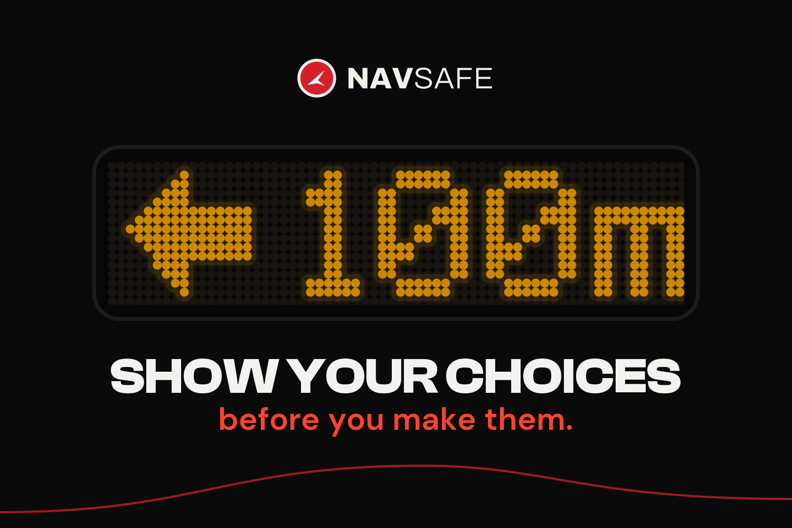
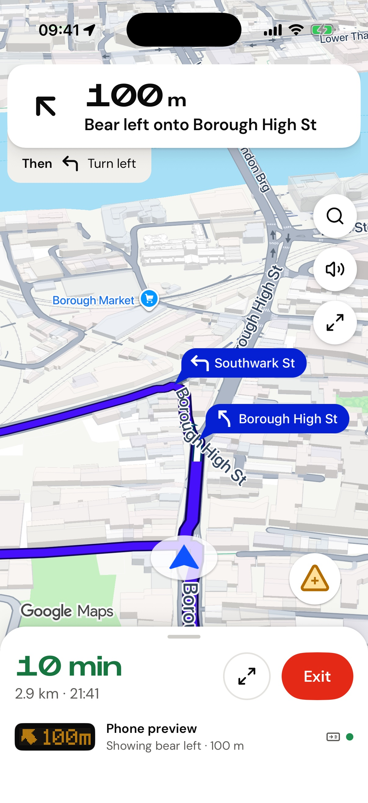
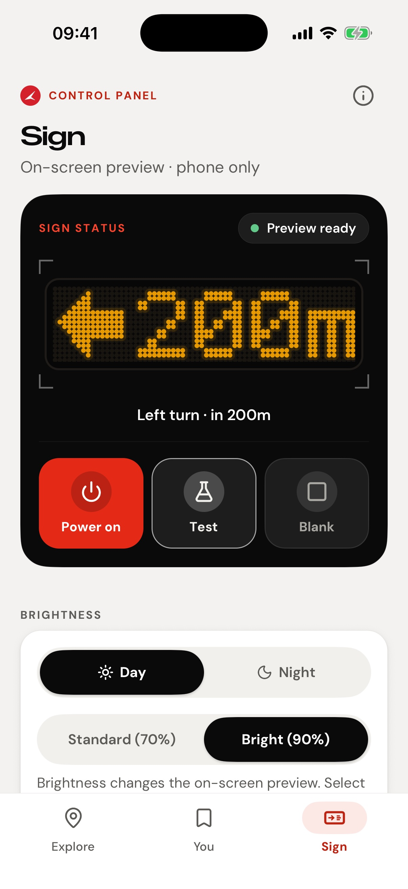
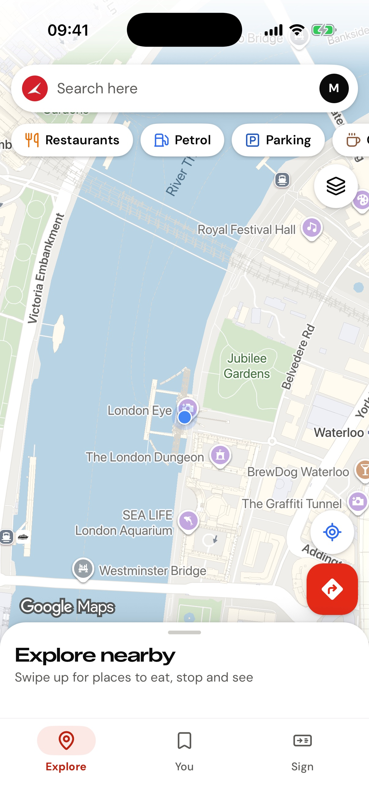
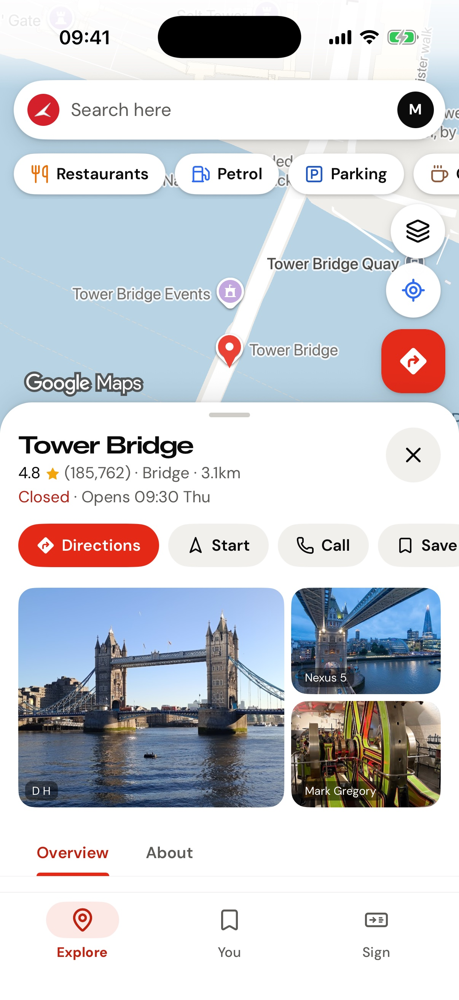
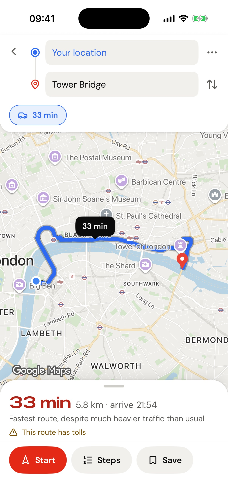

# NavSafe for AltStore

Early-access iPhone builds of [NavSafe](https://navsafe.uk), turn-by-turn
navigation that shows the drivers behind you your next turn on a rear-window
sign. This source carries NavSafe while the App Store version is in review.

**Source URL**

```
https://raw.githubusercontent.com/maxtheobaldd/navsafe-altstore/main/source.json
```

<p>
  
  
  
  
  
</p>

## What you need

- An iPhone on **iOS 16 or later**
- A Mac (macOS 11 or later) or a Windows PC, on the same Wi-Fi as the iPhone
- A USB cable for the first setup
- An Apple ID (a free one works)

## Install

### 1. Put AltStore on your iPhone (one-time)

Follow AltStore's official guide for your computer. It takes about ten minutes:

- **Mac:** [Install AltStore on macOS](https://faq.altstore.io/altstore-classic/how-to-install-altstore-macos)
- **Windows:** [Install AltStore on Windows](https://faq.altstore.io/altstore-classic/how-to-install-altstore-windows)
  (install iTunes and iCloud from Apple's website, not the Microsoft Store)

In short: install **AltServer** on the computer, connect the iPhone by USB,
choose **Install AltStore** from the AltServer icon and sign in with your Apple
ID. Then on the iPhone:

1. **Settings → General → VPN & Device Management**: trust your Apple ID.
2. **Settings → Privacy & Security → Developer Mode**: turn it on and restart.

### 2. Add the NavSafe source

1. Open **AltStore** on the iPhone and go to the **Sources** tab.
2. Tap **+**, paste the source URL above and tap **Add**.

### 3. Install NavSafe

1. Open **NavSafe** from the source (or the **Browse** tab) and tap **Free**.
2. Wait for AltStore to sign and install it, then open NavSafe from the home
   screen.
3. Allow location access. Choose **Always** if you want the sign to keep
   working with the screen off.

## Keeping NavSafe working

- **Refresh every 7 days.** Apps installed with a free Apple ID expire after
  seven days. AltStore refreshes them in the background while AltServer is
  running on your computer on the same Wi-Fi. You can also open AltStore → **My
  Apps** → **Refresh All**. A paid Apple Developer account extends this to a
  year.
- **Updates** appear in AltStore → **My Apps** when a new build is published
  here.
- A free Apple ID can have **three** sideloaded apps at once, and AltStore
  counts as one of them.

## What's different from the App Store version

- **CarPlay** and **Sign in with Apple** aren't available in sideloaded builds.
  Sign in with your email address instead.
- AltStore installs the app under your own Apple ID, so it sits alongside the
  App Store version rather than replacing it. When NavSafe reaches the App
  Store, install that version and delete this one. Anything saved to your
  NavSafe account comes with you when you sign in.

## Something not working?

- Installation problems: see AltStore's
  [troubleshooting guide](https://faq.altstore.io/altstore-classic/troubleshooting-guide).
- App problems: [NavSafe support](https://navsafe.uk/support).
